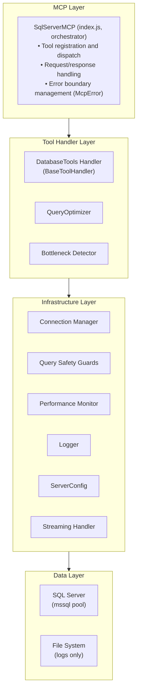
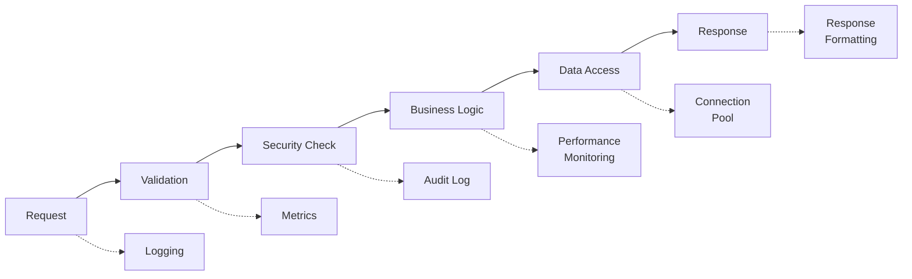
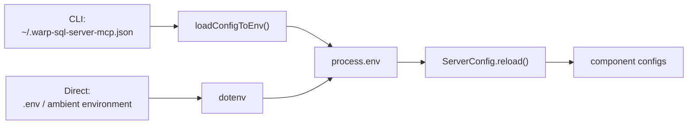
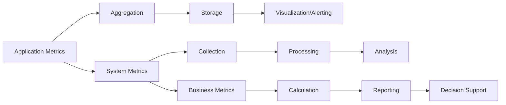
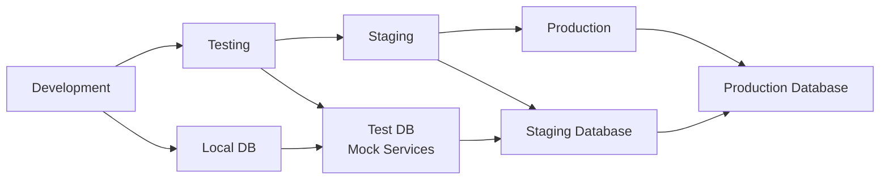

# Architecture Guide: A Framework for Enterprise-Grade Software

> **Audience**: Engineers evaluating the system design and its layering

## Overview

This document describes the architectural design of what appears to be an MCP (Model Context Protocol) server but is
fundamentally **a comprehensive framework for building production-ready, enterprise-grade software systems**. The
architecture demonstrates advanced software engineering principles through practical implementation.

> **How to read this document.** "System Architecture" and "Core Components" describe the
> code as it exists - every component named there maps to a file in this repository. From
> "Error Handling Architecture" onward the document **mixes implemented behavior with
> design aspiration**. Read the markers, not the section titles. The patterns marked
> aspirational (circuit breakers, distributed tracing, blue-green deployment, hot reload,
> schema-validated configuration) are **not implemented**.
>
> **Markers do not cover the whole second half.** Five numbered lists carry per-item
> `_implemented_` / `_aspirational_` markers: "Aspirational Patterns" under Error Handling
> and under Configuration, "Observability Patterns", "Horizontal Scaling Patterns" and
> "Deployment Patterns". Five do **not**: "Testing Patterns", "Security Patterns",
> "Performance Optimization", "Extension Points" and "Design for Change". Those five mix
> real behavior with design goals - intelligent caching and versioned APIs among them -
> so treat an unmarked item as unverified and check it against the code before relying on
> it.

## Architectural Philosophy

The system is built on several key architectural principles:

1. **Layered Architecture**: Clear separation between presentation, business, and data layers
2. **Dependency Inversion**: High-level modules don't depend on low-level modules
3. **Single Responsibility**: Each component has one well-defined purpose
4. **Open/Closed Principle**: Components are open for extension, closed for modification
5. **Interface Segregation**: Components depend only on interfaces they actually use

## System Architecture



## Core Components

> Every component below maps to a file in this repository. The list is exhaustive for the
> startup path: `index.js` constructs exactly `Logger`, `ConnectionManager`,
> `PerformanceMonitor`, `DatabaseToolsHandler`, `QueryOptimizer` and `BottleneckDetector`,
> from the module-level `serverConfig` singleton. **`ConnectionManager` is the exception:**
> `index.js:105` passes it `serverConfig.getConnectionConfig()`, a plain object of four
> timeout/retry values with no `serverConfig` property, and its constructor falls back to
> `config.serverConfig || new ServerConfig()` - so a **second** `ServerConfig` instance
> exists at runtime and a `serverConfig.reload()` on the singleton does not reach it.
> One implemented module -
> `SecretManager` (`lib/config/secret-manager.js`) - is **not** constructed anywhere and
> takes no part in request handling; see
> [ENV-VARS.md](../reference/ENV-VARS.md) for what that means for its environment
> variables, and [#1152](https://github.com/egarcia74/warp-sql-server-mcp/issues/1152)
> for the wiring work.

### 1. SqlServerMCP (Orchestration Layer)

**File**: `index.js`

**Purpose**: Central orchestrator that owns the MCP `Server`, registers tools and routes
each call to a handler.

**Responsibilities**:

- Registers the tool catalogue from `lib/tools/tool-registry.js`
- Dispatches `CallToolRequest` to the matching handler method
- Applies the safety policy to **caller-supplied** SQL: `validateQuery` on `execute_query`
  and `explain_query`, `validateWhereClause` on the `where` argument of `get_table_data`
  and `export_table_csv`. Server-assembled SQL does **not** pass through them -
  `list_databases`, `list_tables`, `describe_table` and `list_foreign_keys` build fixed
  statements and call `executeQuery` directly, relying on the identifier and literal
  escapers (`escapeBracketIdentifier`, `escapeSqlStringLiteral`) for the values they
  interpolate. Two different controls, not one boundary
- Converts failures into `McpError` so no raw driver error escapes
- Exposes runtime diagnostics through `get_server_info`

Its constructor is the whole dependency graph:

```javascript
class SqlServerMCP {
  constructor() {
    this.config = serverConfig; // module-level ServerConfig singleton
    this.config.reload();
    this.logger = new Logger({ ... });
    this.connectionManager = new ConnectionManager(this.config.getConnectionConfig());
    this.performanceMonitor = new PerformanceMonitor(this.config.getPerformanceConfig());
    this.databaseTools = new DatabaseToolsHandler(this.connectionManager, this.performanceMonitor);
    this.queryOptimizer = new QueryOptimizer(this.connectionManager);
    this.bottleneckDetector = new BottleneckDetector(this.connectionManager);
    this.setupToolHandlers();
  }
}
```

### 2. ConnectionManager (Data Access Layer)

**File**: `lib/database/connection-manager.js`

**Purpose**: Owns the single `mssql` connection pool and everything about reaching the
server.

**Responsibilities**:

- Builds the driver config from `ServerConfig.getConnectionConfig()`, including the
  context-aware SSL decision (`_buildConnectionConfig`, `_isLikelyDevEnvironment`)
- Connects with retry (`connect`) and hands the pool to callers (`getPool`)
- Reports pool state for `get_connection_health` (`getConnectionHealth`), plus a TLS
  block that describes **configured intent, not the negotiated connection**:
  `_extractSSLInfo()` rebuilds its fields from `_buildConnectionConfig()` and hard-codes
  `connection_status: "Encrypted connection established"` and `protocol: "TLS/SSL"`
  without inspecting the socket or certificate - its own `note` says certificate details
  are not available through the `mssql` abstraction. The block is also usually absent:
  `getConnectionHealth` adds it only when `SQL_SERVER_ENCRYPT === "true"`, while
  `_buildConnectionConfig` enables encryption on `!== "false"`, so the **default**
  configuration is encrypted and reports no TLS information at all
- Closes the pool on shutdown (`close`)

There is no separate health-monitor object and no circuit breaker: health is computed on
demand from the live pool, and failure handling is bounded retry plus a surfaced error.

### 3. ServerConfig (Configuration Layer)

**File**: `lib/config/server-config.js`

**Purpose**: Derives the grouped configuration objects the components consume, exported as
a module-level singleton and reloaded at startup.

It is **not** the only reader of the environment, and not a single instance either.
`ConnectionManager` builds its own `ServerConfig` (see the Core Components note above) and
additionally reads `process.env` directly in `_buildConnectionConfig()`; `Logger` reads its
own environment defaults too. Changing `ServerConfig` therefore does not cover every
configuration path - grep for `process.env` before assuming it does.

**Responsibilities**:

- Parses every **supported** environment variable, but range-checks only the **numeric**
  ones: the 14 `_safeParseInt` / `_safeParseFloat` calls take a min/max band and reject an
  out-of-range value in favor of the default rather than clamping it to the nearest bound.
  Booleans (`SQL_SERVER_READ_ONLY`, `ENABLE_PERFORMANCE_MONITORING`, `ENABLE_STREAMING`,
  `TRACK_POOL_METRICS`, `ENABLE_SECURITY_AUDIT`, the two `SQL_SERVER_ALLOW_*` flags) are
  bare `=== 'true'` / `!== 'false'` comparisons, so a malformed boolean silently takes the
  default with **no warning** - though those defaults fail safe (read-only on, destructive
  and schema changes off), which is what makes the silence tolerable. Three strings get an
  `||` default when empty or unset - `SQL_SERVER_HOST` to `localhost`, `SQL_SERVER_DATABASE`
  to `master`, `SQL_SERVER_LOG_LEVEL` to `info` - and are otherwise passed through without
  validation, so an unset host quietly becomes `localhost` while a _misspelled_ one is
  attempted as given and fails at connect time. **Credentials are not in that group**:
  `SQL_SERVER_USER` and `SQL_SERVER_PASSWORD` are read raw with no fallback, and in
  `_buildConnectionConfig()` both being falsy selects NTLM and drops the fields entirely,
  so an empty credential changes the _authentication mode_ rather than defaulting. No
  malformed string is ever corrected or warned about
- Groups configuration into connection, security, performance, streaming and logging
  sections. The connection, security and logging sections are consumed by the components
  above; the streaming section is passed to `DatabaseToolsHandler`, which hands it to its
  `StreamingHandler` - see the note below
- Derives the context-aware `SQL_SERVER_TRUST_CERT` default and records why it chose what
  it chose
- Renders the startup configuration summary, with the password masked

> **Note on streaming limits.** `index.js` passes `serverConfig.streaming` to
> `DatabaseToolsHandler`, which constructs its `StreamingHandler` with
> `enableStreaming: streaming.enabled` and `batchSize: streaming.batchSize`, so
> `ENABLE_STREAMING` and `STREAMING_BATCH_SIZE` govern every export. Those are the only two
> streaming settings: the streaming path accumulates every chunk before
> `reconstructFromChunks` joins them into one string, so **no memory or response-size limit
> is enforced**. The two limit variables once documented for this were never read by any
> code path and have been removed (see the CHANGELOG).

### 4. Tool Handlers (Business Logic Layer)

**Files**: `lib/tools/handlers/base-handler.js`, `lib/tools/handlers/database-tools.js`,
`lib/tools/tool-registry.js`

**Purpose**: Implement the individual MCP tools.

- **`BaseToolHandler`** holds the shared plumbing: acquiring the pool
  (`getConnection`), running a query while recording metrics (`executeQuery`), and
  rendering results as a text table or CSV (`formatResults`, `formatAsTable`,
  `formatAsCsv`).
- **`DatabaseToolsHandler`** extends it with the schema and data tools -
  `listDatabases`, `listTables`, `describeTable`, `listForeignKeys`, `getTableData`,
  `exportTableCsv`, `explainQuery`.
- **`tool-registry.js`** is the declarative catalogue (`getAllTools`, `getTool`,
  `getToolsByCategory`) that `index.js` registers with the MCP server.

Analysis tools live beside these: `QueryOptimizer` (`lib/analysis/query-optimizer.js`)
and `BottleneckDetector` (`lib/analysis/bottleneck-detector.js`) query DMVs through the
same `ConnectionManager`. `BottleneckDetector.detectBottlenecks()` backs
`detect_query_bottlenecks`; both are constructed **without** a `PerformanceMonitor`, so
their findings come from live DMV queries rather than the monitor's samples and never
enter its history.

### 5. PerformanceMonitor and Logger (Observability Layer)

**Files**: `lib/utils/performance-monitor.js`, `lib/utils/logger.js`

**`PerformanceMonitor`** records per-query timings, bounded by
`MAX_METRICS_HISTORY` (default `1000`). It classifies a query as slow past
`SLOW_QUERY_THRESHOLD` (default `5000` ms) and backs `get_performance_stats` and
`get_query_performance`. It is an in-memory ring of samples - there is no alert manager and
no external metrics backend.

> **Sampling.** Every production call site records through `recordQuery()`, which applies
> the same `shouldSample()` gate as `startQuery()`, so `PERFORMANCE_SAMPLING_RATE` bounds
> the fraction of queries that enter the history. It does not change how a query executes.
>
> **Pool metrics.** `index.js` attaches `ConnectionManager.getConnectionHealth()` to the
> monitor as its pool source (`setPoolStatsSource`). After each recorded query the monitor
> reads the driver's tarn counters once (`size`, `available`, `pending`, `borrowed`, `max`)
> and records them through `recordPoolMetrics()`, so `get_connection_health` returns both
> the live counters (`connection.pool`) and the monitor's latest snapshot with a health
> assessment (`pool.current`, `pool.health`). `TRACK_POOL_METRICS=false` stops the
> sampling and collapses the monitor's block to `{ enabled: false }`.
> `recordConnectionEvent()` still has no production caller, so the `connect`/`error`/`retry`
> rates in `pool.recent` stay at zero.

**`Logger`** wraps Winston to provide levelled structured logging plus a separate security
audit channel. File transports are **opt-in**: `index.js` passes a path only when
`LOG_FILE` or `SECURITY_LOG_FILE` is set, so the default is console-only. See
[DEBUG-LOGGING.md](../developer/DEBUG-LOGGING.md).

### 6. Query Safety Guards (Validation Layer)

**Purpose**: Enforce the graduated safety tiers on SQL queries to prevent security
vulnerabilities. Enforcement is lexical and fail-closed — not AST/SQL parsing, whose
T-SQL dialect coverage is partial.

**Layers**:

- **`validateQuery` (`index.js`)**: Classifies a statement by its anchored prefix
  (`^\s*SELECT`, `^\s*DELETE`, …) and applies the active tier (read-only →
  destructive-operations → schema-changes). Delegates the whole batch to the batch
  guard whenever any restriction is active.
- **`sql-batch-guard.js` (`findForbiddenBatchStatement`)**: Scans the entire batch —
  after stripping string literals, quoted/bracketed identifiers and comments — for
  statement keywords the active tier forbids, wherever they appear, then requires the
  batch to open with a recognised T-SQL statement keyword. Fails closed on an
  unterminated literal, identifier or block comment (closes `GHSA-qhf4-jmhq-73c8`).
- **`where-clause-guard.js` (`findForbiddenWhereClauseSyntax`)**: Validates the
  caller-supplied WHERE clause for `get_table_data`/`export_table_csv`, requiring a
  single predicate on the requested table and rejecting batch separators, comments,
  statement keywords, top-level set operators/`SELECT` and unbalanced parentheses.

**Design Approach**:

- **Single-pass lexical scanning**: No regex backtracking on untrusted input
- **Fail-closed**: Malformed or unterminated input is rejected, never approved
- **Tiered enforcement**: Each guard consults the active read-only/destructive/schema tier

## Data Flow Architecture

### Request Processing Flow



### 1. **Request Ingress**

- Protocol validation (MCP compliance)
- Input sanitization
- Request logging
- Metrics initiation

### 2. **Security Processing**

- Query safety validation against the active tier (`validateQuery`, `validateWhereClause`)
- Audit event generation (`Logger.security`)

There is no per-request authentication or authorization layer in the MCP server itself: the
process holds one set of database credentials, and access control is whatever the SQL
Server login is granted plus the read-only/DML/DDL tier. Least-privilege database accounts
are the intended control - see [SECURITY.md](SECURITY.md).

### 3. **Business Logic Execution**

- Tool-specific processing in the handler
- Error handling and normalization into `McpError`
- Result formatting (text table or CSV)

Tools issue statements **or multi-statement T-SQL batches** against the pool -
`lib/security/sql-batch-guard.js` exists precisely to scan every statement in a batch - and
passing `database` to `execute_query` runs a separate `USE [...]` query first. There is no
explicit transaction-management layer.

### 4. **Data Layer Operations**

- Connection acquisition
- Query execution
- Result processing
- Connection release

### 5. **Response Egress**

- Response validation
- Performance metrics
- Audit logging
- Error normalization

## Error Handling Architecture

### As Implemented

There is no error class hierarchy. Every failure that leaves a tool is normalized into the
MCP SDK's `McpError` with an `ErrorCode`, so the client sees a protocol-level error and
never a raw `mssql` or Node error object. Connection failures are retried with backoff in
`ConnectionManager.connect()`; a safety-policy rejection is raised immediately by
`validateQuery` / `validateWhereClause`.

> **⚠️ Rejections get a _detailed_ audit entry only when `ENABLE_SECURITY_AUDIT=true`, which
> is not the default.** With it off, `Logger` never constructs a `securityLogger`, so
> `Logger.security()` returns early - but not silently: it first calls
> `this.warn('Security logging is disabled', { event, message })`, which puts
> `event: "QUERY_BLOCKED"` and the policy message into the main log. So a coarse record of
> _that_ a query was blocked survives on a default install; the blocked SQL, the specific
> reason, the tool and the severity do not. Do not plan an audit trail around the default
> configuration.

### Aspirational Patterns

> **Partly implemented - read the per-item markers.** There is no circuit breaker and no
> graceful-degradation path: a database that is unreachable produces an error per call.

1. **Fail Fast**: Detect errors as early as possible - _implemented_ for query validation
2. **Error Boundaries**: Prevent error propagation between layers - _implemented_ via `McpError`
3. **Graceful Degradation**: Maintain partial functionality during failures - _aspirational_
4. **Circuit Breaker**: Prevent cascade failures - _aspirational_
5. **Retry with Backoff**: Handle transient failures - _implemented_ for connection setup only

## Configuration Architecture

### As Implemented

`ServerConfig` reads configuration from the process environment at startup
(`ServerConfig.reload()`), with `dotenv` loading `.env` first. Values are checked against a
min/max band rather than a schema, and an out-of-range value is rejected in favor of the
default rather than clamped. There is no runtime layer - changing a variable requires
restarting the server - but the CLI does put a file layer in front of the environment:
`warp-sql-server-mcp start` calls `loadConfigToEnv()` in `cli.js`, which reads
`~/.warp-sql-server-mcp.json` and copies each key into `process.env`, skipping any variable
that is already set. So a file-based layer exists for the recommended global-install path,
the ambient environment wins over the file, and `ServerConfig` itself still only ever sees
environment variables.



### Aspirational Patterns

> **Not implemented.** Schema validation and hot reload do not exist today. A file
> configuration layer does exist, but only as the CLI's file-to-environment adapter
> described above - not as something `ServerConfig` reads.

1. **Schema Validation**: All configuration validated against schema - _aspirational_ (values get min/max band checks with fallback to defaults)
2. **Environment Parity**: Same configuration structure across environments - _implemented_
3. **Secure Defaults**: Safe operational defaults - _implemented_ (read-only by default)
4. **Hot Reload**: Runtime configuration updates where safe - _aspirational_

## Monitoring and Observability

### Metrics Architecture



### Observability Patterns

> **Partly aspirational.** There is no metrics backend, no tracing and no alerting: metrics
> live in an in-memory ring inside `PerformanceMonitor` and are read back through MCP tools.

1. **Structured Logging**: Consistent, searchable log format - _implemented_ (`Logger`, Winston)
2. **Distributed Tracing**: Request flow across components - _aspirational_
3. **Metrics Collection**: Quantitative system measurements - _implemented_, in-memory only
4. **Health Checks**: Automated system health assessment - _implemented_ (`get_connection_health`)
5. **Alerting**: Automated incident response - _aspirational_

## Testing Architecture

### Test Pyramid

```text
                    ▲
                   /E\     End-to-End Tests
                  /___\    (Integration validation)
                 /     \
                / Unit  \   Unit Tests
               /  Tests  \  (Component behavior)
              /___________\
```

### Testing Patterns

1. **Test Isolation**: Each test runs independently
2. **Mock Strategy**: External dependencies mocked consistently
3. **Behavior Verification**: Tests verify behavior, not implementation
4. **Edge Case Coverage**: Comprehensive error condition testing
5. **Performance Testing**: Load and stress testing included

## Security Architecture

### Security Layers


### Security Patterns

1. **Defense in Depth**: Multiple security layers
2. **Principle of Least Privilege**: Minimal necessary access
3. **Security by Default**: Secure default configurations
4. **Audit Trail**: Comprehensive security event logging
5. **Threat Modeling**: Systematic security analysis

## Scalability Considerations

### Horizontal Scaling Patterns

> **Partly aspirational.** The server is a single stdio process launched by one MCP client;
> load balancing and circuit breaking are design goals for a future deployment shape, not
> current behavior.

1. **Connection Pooling**: Efficient database connection reuse - _implemented_ (`mssql` pool)
2. **Stateless Design**: No per-request session state - _partial_. `PerformanceMonitor`
   holds process-local state (bounded query history, aggregates, connection metrics, start
   time), so `get_performance_stats` and `get_query_performance` return instance-specific
   data and two instances are **not** interchangeable for them.
3. **Load Balancing**: Request distribution across instances - _aspirational_
4. **Circuit Breaker**: Fault isolation and recovery - _aspirational_

### Performance Optimization

1. **Query Optimization**: SQL performance monitoring and tuning
2. **Caching Strategy**: Intelligent data caching
3. **Resource Management**: Efficient resource utilization
4. **Asynchronous Processing**: Non-blocking operations where possible

## Deployment Architecture

### Environment Progression



### Deployment Patterns

> **Aspirational.** The server ships as an npm package that an MCP client spawns locally.
> There is no deployment pipeline of its own beyond the release workflow, so blue-green
> deployment and rollback describe a target shape rather than anything implemented here.

1. **Blue-Green Deployment**: Zero-downtime deployments - _aspirational_
2. **Configuration Management**: Environment-specific configuration - _implemented_
3. **Health Checks**: Automated deployment validation - _aspirational_ (`get_connection_health` exists but is an on-demand MCP tool; no workflow or script invokes it during a release)
4. **Rollback Capability**: Quick failure recovery - _aspirational_ (npm version pinning only)

## Future Extensibility

### Extension Points

> **Aspirational.** None of these extension points exists yet. Adding a tool today means
> editing `lib/tools/tool-registry.js` and a handler; there is no plugin loader, event bus
> or provider interface.

1. **Plugin Architecture**: Modular tool additions
2. **Event System**: Extensible event handling
3. **Configuration Providers**: Multiple configuration sources - the not-yet-wired-up `SecretManager` is the closest thing
4. **Monitoring Backends**: Pluggable monitoring systems
5. **Authentication Providers**: Multiple auth mechanisms - SQL and Windows auth are supported today

### Design for Change

1. **Interface-Based Design**: Dependencies on abstractions
2. **Configuration-Driven Behavior**: Runtime behavior modification
3. **Modular Architecture**: Independent component evolution
4. **Versioned APIs**: Backward-compatible interface evolution

## Conclusion

This architecture represents a comprehensive approach to building enterprise-grade software systems. It demonstrates how rigorous engineering principles can be applied to create software that is:

- **Reliable**: Consistent behavior under various conditions
- **Maintainable**: Clear structure enables safe modifications
- **Scalable**: Architecture supports growth in load and complexity
- **Secure**: Multiple layers of security controls
- **Observable**: Comprehensive monitoring and debugging capabilities
- **Testable**: Architecture facilitates comprehensive testing

The patterns and principles demonstrated here are transferable to any software engineering project requiring enterprise-grade quality and operational characteristics.
